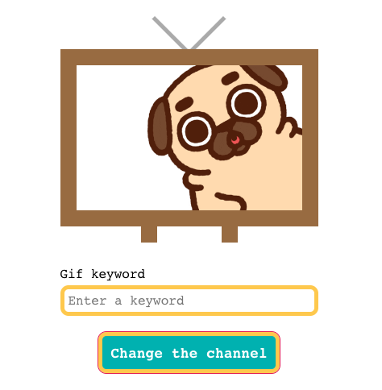

# React Telly Demo Branch 📺

React Telly is a friendly little gif television to help you learn how to use, modify, and build components with React + TypeScript.

This project was bootstrapped with [Create React App](https://github.com/facebook/create-react-app). To learn React, check out the [React documentation](https://reactjs.org/).

# Getting Started

## Node.js configuration

We use NVM to control Node.js versions. If you don't already have NVM installed, [do so using the instructions from the NVM docs](https://github.com/nvm-sh/nvm#installing-and-updating).

## Available Scripts

You will want to make sure your node version matches the projects by running:

### `nvm use`

In the project directory, run:

### `yarn`

to install dependencies, then

### `yarn start`

to start the development server. Open [http://localhost:3000](http://localhost:3000) to view it in the browser. The page will reload if you make edits. You will also see any lint errors in the console.

To format your code with prettier, run:

### `yarn format`

For testing,

### `yarn test`

Launches the test runner in the interactive watch mode.

# Workshop Set-up

To get credentials for the Giphy API:

- Create a `.env` file in the root of the project. To do this you can either add a new file in your code editor or run `touch .env` in the terminal. On the first line of your new file, paste the following: `REACT_APP_GIPHY_API_KEY=`
- Make a [Giphy developer account](https://developers.giphy.com/)
- On the [dashboard page](https://developers.giphy.com/dashboard/?), select "Create an App." Choose the free "API" option, then give your app a name and description. Once you have created the project, copy the API key.
- paste the key into your `.env` file right after the equal sign in `REACT_APP_GIPHY_API_KEY=`
- stop your development server by hitting `control` + `c` in the terminal window where your server is running, then run `yarn start` to restart it
- Note: if you are having issues making API calls and see a `Request Header Or Cookie Too Large` error in the response, clear you browser cookies and restart your server

# Lesson 1: Working with Props and State

## 1. Render the `Button` component in the `HomePage` component and make the button log something to the console

- You can find the `HomePage` component at `src/pages/home/home.tsx` and the `Button` component at `src/components/Button/Button.tsx`

## 2. Now update the button so that when it is clicked, a random gif renders in the `GifViewer` component

- To do this, you will need to fetch data via the `useGif` hook, which is already imported into the `HomePage` component. `fetchNewGif` is the fetch function and `gif` is that data that is returned from the API.
- You will also need to pass the `gif` data to the `GifViewer` component as a prop. Hint: it will be helpful to look at the `GifViewer` component at `src/components/GifViewer/GifViewer.tsx` to see what props it expects.

## 3. Pass `isLoading` and `isError` to the `GifViewer` component as props

- You'll notice that the `useGif` hook returns both `isLoading` and `isFetching`, which you can read more about [here](https://tanstack.com/query/v4/docs/react/reference/useQuery). For a smooth loading experience you may want to combine them.

## 4. Update the text on the button so it says "Start" until the first time it has been clicked, and then "Change the channel" after that

- Hint: the [useState hook](https://react.dev/reference/react/useState) is a good way to achieve this

### You can see a demo of the completed UI for this lesson at https://react-telly.vercel.app/.

# Lesson 2: Building and Updating Components

Now that we've worked with some existing components, let's build our own! Your goal is to create a text input that **allows the user to type a keyword in the input and then click the button to fetch a gif to display in the television based on that keyword.**

Here are some specifics for the challenge:

- After the user has clicked the button to submit the keyword, the input should revert to its empty state.
- The input should have a label, a focus state, and be styled to match this screenshot:
  

## Additional considerations

- What happens if the user clicks the button without typing anything in the input? It's up to you whether to disable to button or supply a default keyword.
- What happens if the user types a keyword that doesn't return any results from the API? Make sure the user sees a clear message that there are no results.

## Stretch goal

- Make it so the user can submit their keyword by hitting the enter key.

## Super stretch goal

- Take a look at `src/data/gif.ts` and see how the request url is set up to only fetch g-rated gifs. Can you update `fetchGif` and the corresponding `useGif` hook to make the rating optional? Then create a checkbox component so the user can choose whether to see g-rated gifs or not.

### You can see a demo of the completed UI for this lesson at https://react-telly.vercel.app/lesson-2.
